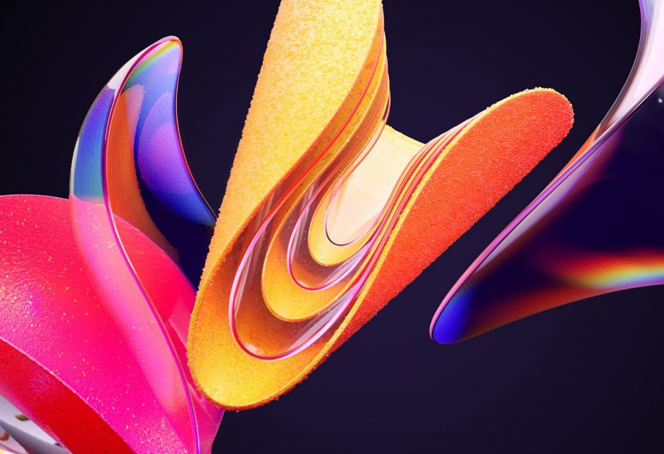

  ## 1. Perceptível
 
  __1.1 Alternativas de texto:__
  É muito importante dar alternativas de texto para conteúdosnão textuais, para que possa ser alterado para outras formas que as pessoas precisem, como letras grandes, braille, fala, símbolos ou linguagem mais simples.
 
 
 

Implementação da descrição dessa imagem usando a Tag Alt:

 ```

 ```
 # 




__1.2 Mídia baseada em tempo__
#

__1.3 Adaptável__
# 

__1.4 - Distinguível__
# 

## 2. Operável

__2.1	Teclado acessível__
# 

__2.2 Tempo suficiente__
# 

__2.3 - Convulsões e Reações Físicas__
# 

__2.4 - Navegável__
# 

__2.5 - Modalidades de Entrada__
# 

## 3 Compreensível

__3.1 Legível__

__3.2 Previsível__

__3.3 Assistência de entrada__

## 4. Robusto

__4.1 Compatível__


